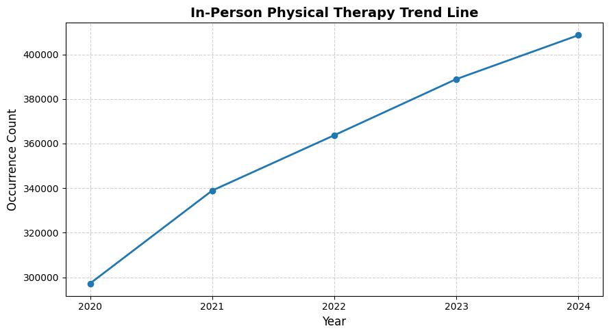

# Investigating Trends in In-Person and Online Physical Therapy from 2020 to 2025
## Introduction
Over the summer, I have been working as a receptionist at a physical therapy wellness center. While working, I questioned possible shifts in the trends of treatments due to the enhancement in technology and AI. 

This project will help to illustrate the current trends of in-person and online treatments and estimate the trends of patient behaviors in the near future. 

Going into the project, I expected that the number of in-person physical therapy visits would decrease and the number of online visits would increase due to the increasing use of technology.

I decided to split the experiment into two parts. I wanted to see what people are searching for online and if it had a correlation with actual behavior.
## Part 1: Online Search Trends
I initially started thinking that I wanted to use Google’s own api, but it was deprecated. As a result, I found another api that works similarly to Google’s. I used Serpapi to generate codes of data that provided the data sets of the numbers of in-person and online physical therapy in 2020 to 2025. With the code generated, I used Google Colab to use the code and form graphs that show trends of each over the years.

